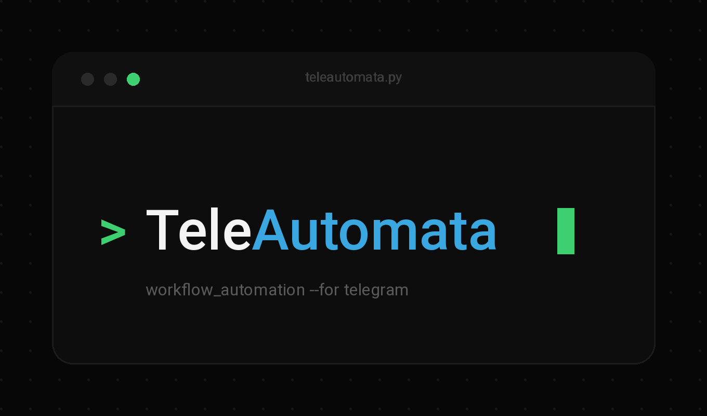

<div align="center">



<h1>TeleAutomata</h1>

<p><strong>Safety-first, workflow-driven Telegram account automation.</strong></p>

<p>
  
  <a href="LICENSE"></a>
  
  
</p>

</div>

<!--
  Demo: to show a short terminal recording, drop it at docs/assets/demo.gif
  and uncomment the line below.
  <p align="center"></p>
-->

TeleAutomata manages Telegram groups and channels by running **declarative YAML
workflows** against a real user account. You describe *what* should happen — send
a message, create a channel, add members from a CSV, restrict a user — and the
engine handles dependency ordering, retries, flood-wait handling, and a durable
record of every run.

## Why it exists

Automating a Telegram user account is easy to do badly: an ad-hoc script fires
requests as fast as it can, has no memory of what already ran, and treats a
rate-limit or a permission error as a crash. TeleAutomata is built the opposite
way, around three commitments:

- **Safety is the default.** Telegram's rate limits, permissions, and responses
  are treated as authoritative — never bypassed. Every shipped example is a
  dry run, and going live is a deliberate, confirmed act.
- **Runs are durable.** Every execution and action is persisted as it happens, so
  an interrupted run resumes instead of starting over, and you can inspect
  exactly what occurred afterwards.
- **The architecture is the product.** A small, coherent, well-tested core with a
  frozen, representative action set — not a sprawling pile of one-off commands.

It automates a **user account** over MTProto (via Telethon), which is distinct
from — and more capable than — the Bot API, and carries the same limits a human
account does.

## Capabilities

- **Declarative workflows** — a versioned YAML schema with a validated dependency
  graph (DAG); independent actions run concurrently, dependent ones wait.
- **29 actions** across entity management, messaging, dialogs, membership, and
  member management — a deliberately frozen, representative set.
- **Resilient execution** — per-action retry policies with full-jitter backoff,
  flood-wait handling with a safety ceiling, and per-user failure isolation in
  batch actions.
- **`continue_on_error`** for genuinely optional steps, with honest reporting.
- **Dry-run by file property** — no `--dry-run` flag; `dry_run: true` plans a run
  with no credentials and no network, so intent is reviewable in version control.
- **Durable history & resume** — a SQLite (local) or PostgreSQL (production)
  operation database, inspectable via `history` and `status`.
- **A polished CLI** — Typer + Rich output that degrades cleanly to plain text in
  pipes and CI.
- **Strictly typed, offline-tested** — strict mypy, and a test suite that runs
  without a network or credentials against a fake gateway.

## Architecture at a glance

TeleAutomata is ports-and-adapters: a pure **domain** core, an **application**
engine that orchestrates workflows, and **infrastructure** adapters (Telethon,
persistence, pacing) behind a single `TelegramGateway` contract. Because the
engine depends only on that contract, the whole system runs against an in-memory
fake in tests. See [docs/architecture.md](docs/architecture.md) for the full
design, diagrams, and rationale.

## Installation

Requires **Python 3.12+**. The project is not yet published to a package index;
install it from source:

```bash
git clone https://github.com/AryanGh-imp/TeleAutomata.git
cd TeleAutomata

python -m venv .venv
source .venv/bin/activate          # Linux/macOS
# Windows PowerShell:
.\.venv\Scripts\Activate.ps1

pip install -e ".[dev]"            # Add ,postgres for PostgreSQL support
```

## Quick start

```bash
cp .env.example .env               # then add your API id/hash from my.telegram.org
teleautomata init                  # create runtime dirs + database
teleautomata validate examples/workflows/create-channel.yaml
teleautomata run examples/workflows/create-channel.yaml
```

That example is `dry_run: true`, so it records a planned execution but makes no
Telegram request and needs no credentials. Authenticate an account only when you
are ready to run for real:

```bash
teleautomata auth primary          # interactive phone / 2FA; nothing is stored but the session
```

Inspect workflows and past runs at any time, without connecting to Telegram:

```bash
teleautomata list examples/workflows   # validate and summarize every workflow
teleautomata history                   # recent executions
teleautomata status <execution-id>     # per-action detail for one execution
```

If a run is interrupted, resume it without repeating completed work:

```bash
teleautomata resume <workflow.yaml> <execution-id>
```

> **Never** commit `.env` or the `sessions/` directory. Credentials come only
> from the environment or `.env`, and a session file is account access material.

## Workflow format

```yaml
version: 1
name: update-project-channel
account: primary                     # a local session name, not a phone number
dry_run: true
actions:
  - id: check_target
    type: resolve_target
    with: {target: "@my_project"}
  - id: update_description
    type: update_entity
    depends_on: [check_target]       # runs only after check_target succeeds
    with:
      target: "@my_project"
      about: "A current project description"
    retry: {max_attempts: 3, initial_delay_seconds: 2, max_delay_seconds: 60}
```

The full authoring guide — every field, dependency and retry semantics, and
common mistakes — is in [docs/workflows.md](docs/workflows.md); the 29 actions and
their arguments are catalogued in [docs/actions.md](docs/actions.md).

## Command-line interface

| Command | Purpose |
| --- | --- |
| `init` | Create runtime directories and initialize the database. |
| `auth <account>` | Interactively authenticate an account session. |
| `validate <file>` | Validate a workflow's schema and dependency graph (no network). |
| `run <file> [--yes]` | Run a workflow (dry-run or live). |
| `resume <file> <id> [--yes]` | Retry only the unfinished actions of a prior run. |
| `list [dir]` | Validate and summarize every workflow in a directory. |
| `history [--limit N]` | Show recent executions. |
| `status <id>` | Show per-action status for one execution. |

Exit codes are a stable contract (`0` success, `1` expected failure, `2` usage
error). Full descriptions and examples: [docs/cli.md](docs/cli.md).

## Examples

The [`examples/`](examples/) directory is a runnable cookbook: **sixteen** small,
focused workflows covering messaging, dialogs, entity and member management,
retry and `continue_on_error`, every accepted target format, CSV-driven member
lists, and a branching/fan-in DAG. All ship with `dry_run: true`, so they are
safe to run as-is with no credentials.

```bash
teleautomata list examples/workflows                    # validate all sixteen
teleautomata run examples/workflows/send-message.yaml   # dry-run one
```

Each example is indexed and explained in [docs/examples.md](docs/examples.md). To
run workflows in CI, [`examples/github-actions/`](examples/github-actions/)
provides copy-and-adapt templates — validate-on-push, manual, scheduled, and an
install-from-PyPI variant — with the full walkthrough in
[docs/github-actions.md](docs/github-actions.md).

## Documentation

**Using it**
&nbsp;·&nbsp; [Workflows](docs/workflows.md)
&nbsp;·&nbsp; [Actions](docs/actions.md)
&nbsp;·&nbsp; [CLI](docs/cli.md)
&nbsp;·&nbsp; [Examples](docs/examples.md)
&nbsp;·&nbsp; [Configuration](docs/configuration.md)

**Running in production & CI**
&nbsp;·&nbsp; [Security](docs/security.md)
&nbsp;·&nbsp; [GitHub Actions](docs/github-actions.md)
&nbsp;·&nbsp; [Troubleshooting](docs/troubleshooting.md)

**Understanding it**
&nbsp;·&nbsp; [Architecture](docs/architecture.md)
&nbsp;·&nbsp; [Workflow engine](docs/workflow-engine.md)
&nbsp;·&nbsp; [Telegram integration](docs/telegram-integration.md)
&nbsp;·&nbsp; [API & interfaces](docs/api.md)
&nbsp;·&nbsp; [Public API contract](PUBLIC_API.md)

**Contributing & reference**
&nbsp;·&nbsp; [Contributing](CONTRIBUTING.md)
&nbsp;·&nbsp; [Development](docs/development.md)
&nbsp;·&nbsp; [Extending](docs/extending.md)
&nbsp;·&nbsp; [Testing](docs/testing.md)
&nbsp;·&nbsp; [FAQ](docs/faq.md)

## Development

Set up an editable install with dev dependencies and run the quality gate before
every change:

```bash
pip install -e ".[dev]"
ruff check . && ruff format --check . && mypy src && pytest && python -m build
```

Tests use in-memory SQLite and a fake gateway — no network, no credentials. See
[CONTRIBUTING.md](CONTRIBUTING.md) for the contribution workflow and
[docs/development.md](docs/development.md) for environment specifics.

## Security

TeleAutomata automates real accounts, so it treats everything it touches as
capable of real-world effect. Credentials are never persisted; session files are
password-equivalent; and pacing defaults are conservative. Only automate entities
and accounts you are authorized to manage. Full guidance is in
[docs/security.md](docs/security.md), and vulnerabilities should be reported per
[SECURITY.md](SECURITY.md).

## Project status

Version **1.0.0**, with a frozen public API defined in
[PUBLIC_API.md](PUBLIC_API.md). The project is **not yet published** to PyPI —
install from source as shown above.

## License

Released under the [MIT License](LICENSE).
