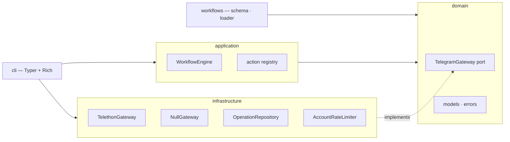
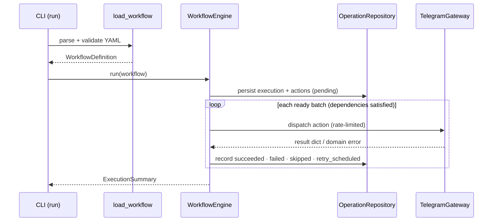

# Architecture

TeleAutomata is built ports-and-adapters (hexagonal). The design goal is stated
plainly in the project's philosophy — *the architecture is the product, not the
action count*. Everything here serves four properties: **safety** (a live run is
a deliberate act, never an accident), **replaceability** (the Telegram client is
one adapter behind a contract), **testability** (the whole engine runs against a
fake gateway with no network), and a **small, coherent surface** (a frozen,
representative action set rather than an ever-growing one).

This page is the map of how the system is built and why. For the runtime
*semantics* it only summarizes, follow the links: execution rules live in
[workflow-engine.md](workflow-engine.md), the Telegram boundary in
[telegram-integration.md](telegram-integration.md), the file format in
[workflows.md](workflows.md), and the stability contract in
[../PUBLIC_API.md](../PUBLIC_API.md).

## Layers and dependency direction

Dependencies point **inward**. The domain core depends on nothing in the
framework; the application layer depends only on the domain; infrastructure
implements the domain's contracts; and the CLI wires concrete adapters into the
application at the edge.



- **`domain`** — the pure core: operation state (`OperationStatus`), result and
  read-model types (`ActionResult`, `ExecutionSummary`, `ExecutionRecordView`,
  `OperationRecordView`), the error taxonomy, and the `TelegramGateway`
  `Protocol`. It imports nothing from the rest of the framework.
- **`application`** — orchestration: the `WorkflowEngine` and the typed action
  registry. It knows the domain contracts, never a concrete client.
- **`infrastructure`** — the adapters that satisfy domain contracts:
  `TelethonGateway` (the real client), `NullGateway` (the dry-run guard),
  `OperationRepository` (persistence), and `AccountRateLimiter` (pacing).
- **`workflows`** — the workflow schema and loader; validates a file into a
  `WorkflowDefinition` before the engine ever sees it.
- **`config`**, **`observability`**, **`cli`** — settings, structured logging,
  and the Typer/Rich entry point that assembles everything.

Because the engine depends only on the `TelegramGateway` port, tests substitute
an in-memory fake and exercise every path — retries, flood-wait, dependency
skipping — without a network or credentials.

## Package layout

```text
teleautomata/
├── domain/          # pure core: models, errors, the gateway port
├── application/     # orchestration: engine, action registry
├── infrastructure/  # adapters: Telethon, persistence, pacing, null gateway
├── workflows/       # workflow schema and loader
├── config/          # settings
├── observability/   # structured logging
└── cli/             # Typer entry point and Rich presentation layer
```

At the repository level, `docs/` holds this documentation, `examples/` holds
runnable workflows and CI templates, `tests/` holds the offline suite, and
`alembic/` holds database migrations.

## From YAML to execution

A run is a straight line from a file to a persisted summary. The CLI is a thin
wrapper over the same wiring you can embed yourself (see [api.md](api.md)).



1. **Load and validate.** `load_workflow` safe-loads the YAML and constructs a
   `WorkflowDefinition`, which enforces the schema and the dependency graph
   (unique ids, resolvable deps, no cycles). Invalid files never reach the
   engine. See [workflows.md](workflows.md).
2. **Select a gateway.** A `dry_run: true` workflow is run against `NullGateway`;
   a live run connects a `TelethonGateway` for the workflow's `account`.
3. **Execute the DAG.** The engine persists the execution, then repeatedly runs
   the batch of actions whose dependencies have completed, bounded by
   `MAX_CONCURRENCY`, applying retries and outcome rules per action. Full rules:
   [workflow-engine.md](workflow-engine.md).
4. **Summarize.** The engine returns an `ExecutionSummary`; the CLI renders it
   and exits with the contract's code.

## Persistence model

Every execution and every action is written to the operation database **before**
it runs and updated at each transition, so a run is fully reconstructable and
resumable. An action moves through:

```text
pending → running → succeeded | failed | skipped
                 ↘ retry_scheduled ↩ (between attempts)
```

Persisting before running — not after — is what makes `resume` safe: an
interrupted run has already recorded which actions reached `succeeded`, so a
resume re-attempts only the rest. The database is reached only through
`OperationRepository`; the reporting commands (`history`, `status`) and the
`ExecutionRecordView` / `OperationRecordView` read models are the supported way
to inspect recorded state — never direct table reads (see
[../PUBLIC_API.md](../PUBLIC_API.md)). Storage is a single SQLAlchemy async URL:
SQLite by default for zero-config local use, PostgreSQL in production, with the
same code path either way (see [configuration.md](configuration.md)).

## Concurrency and pacing

Two independent mechanisms bound throughput:

- **DAG batching** runs independent actions concurrently up to
  `MAX_CONCURRENCY`. Ordering comes only from `depends_on`.
- **Per-account rate limiting** (`AccountRateLimiter`) serializes and spaces
  calls from a single account by `MIN_REQUEST_INTERVAL_SECONDS`, so concurrency
  never translates into a burst against one account.

The limiter is **in-process**. The load-bearing invariant is *one worker per
account session*: a Telethon session must never be shared across workers or
processes. To scale beyond one process, put a leased queue in front while keeping
one worker per account — do not distribute a session. Details in
[telegram-integration.md](telegram-integration.md#rate-limiting).

## Error handling and the anti-corruption boundary

Telegram's error vocabulary enters the system in exactly one place. Inside
`TelethonGateway`, every client call funnels through a single translation step
that maps Telethon exceptions onto three domain errors — `RateLimitError`
(flood wait), `TransientActionError` (temporary/service/network), and
`PermanentActionError` (invalid request, permission, privacy). The engine then
decides retry behaviour purely from the domain error type, so retry policy is
independent of the client library. The full mapping table is in
[telegram-integration.md](telegram-integration.md#anti-corruption-boundary), and
how the engine acts on each class is in
[workflow-engine.md](workflow-engine.md#retries-and-error-classes).

## Design decisions

The choices that most shape the system, and why:

- **Ports and adapters.** The engine talks to a `TelegramGateway` protocol, not
  Telethon. This is what makes the client replaceable and the whole engine
  testable against a fake — the single most important structural choice.
- **A frozen, representative action set.** The library is deliberately capped at
  29 actions. API stability and a coherent surface matter more than raw count;
  operations that would issue the same MTProto call as an existing action are
  documented as aliases rather than duplicated (for example `kick` folds into
  `remove_members`, `restore` into `unban_members`). See
  [extending.md](extending.md).
- **Dry-run is a property of the workflow file, not a CLI flag.** The intent to
  run or merely plan travels *with* the workflow and is reviewable in version
  control. `dry_run: true` swaps in `NullGateway`, so a plan needs no credentials
  and cannot touch an account. Every shipped example is a dry run.
- **Persist before running.** Recording each state transition up front buys both
  auditability and safe resume; nothing is inferred after the fact.
- **Full-jitter backoff.** Retry delay is
  `random.uniform(0, min(max_delay, initial * 2 ** (attempt - 1)))`, which
  spreads retries and avoids synchronized bursts against Telegram.
- **A single anti-corruption boundary.** One translation point keeps retry logic
  free of client-library specifics and gives errors a stable domain vocabulary.
- **Import-time drift guard.** `registry.assert_consistent_with_schema()` runs on
  import and fails fast if the action registry and the `ActionType` literal ever
  diverge, so the schema and the dispatch table cannot silently disagree.
- **Secrets never persisted.** Credentials are read only from the environment or
  `.env`; the framework never writes them to YAML, logs, arguments, or the
  database. The one piece of account material on disk is the Telethon session
  file (see [security.md](security.md)).

## Extending the system

The two supported extension points are adding an action (register a handler,
extend the `ActionType` literal, implement the gateway method on both adapters)
and adding a gateway (implement the `TelegramGateway` protocol). Both are on the
stable API. See [extending.md](extending.md) and [development.md](development.md).

## Related reading

- [workflow-engine.md](workflow-engine.md) — execution semantics in full.
- [telegram-integration.md](telegram-integration.md) — the gateway boundary.
- [api.md](api.md) — importable types and embedding the engine.
- [workflows.md](workflows.md) — the workflow file format.
- [../PUBLIC_API.md](../PUBLIC_API.md) — what is stable versus internal.
